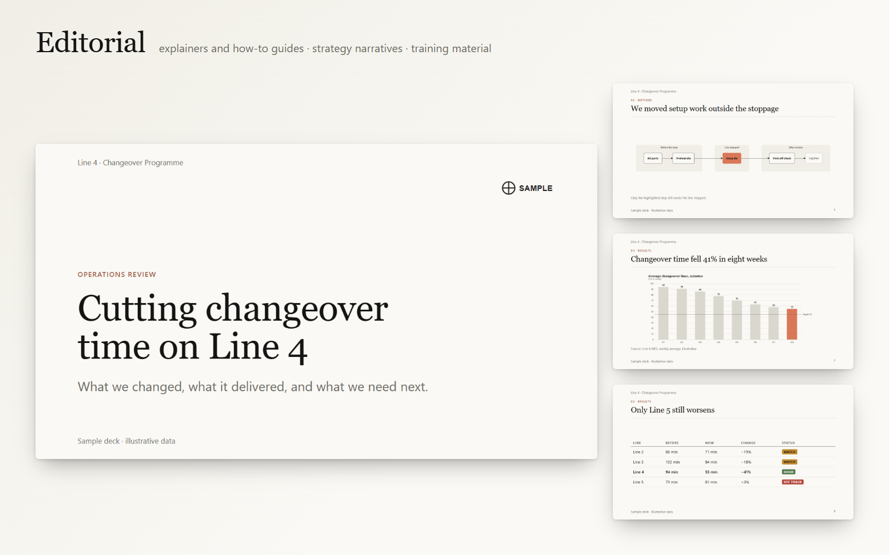
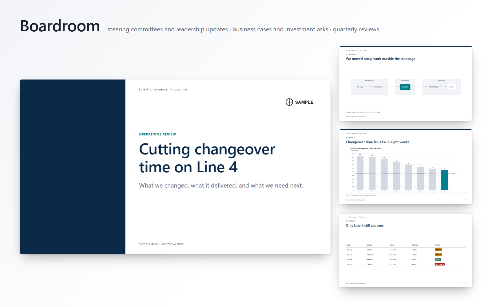
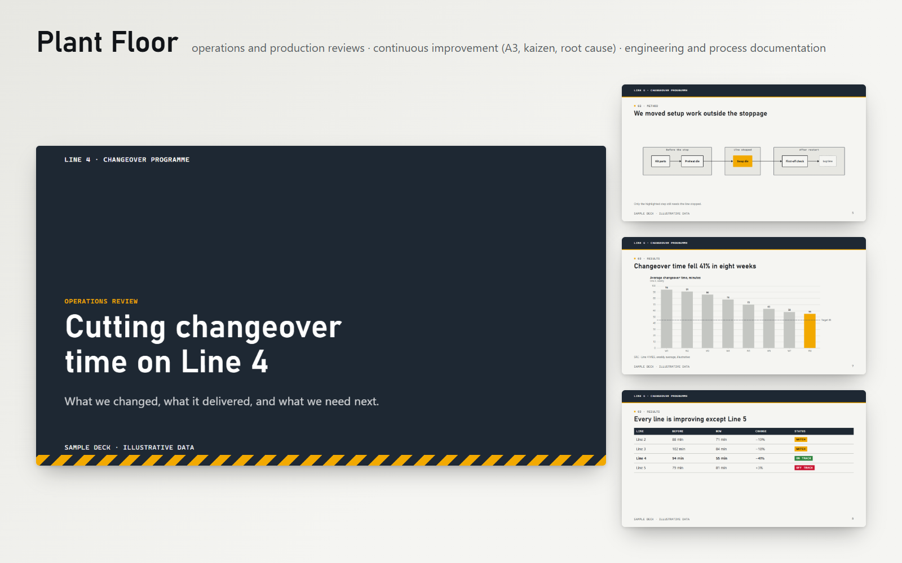
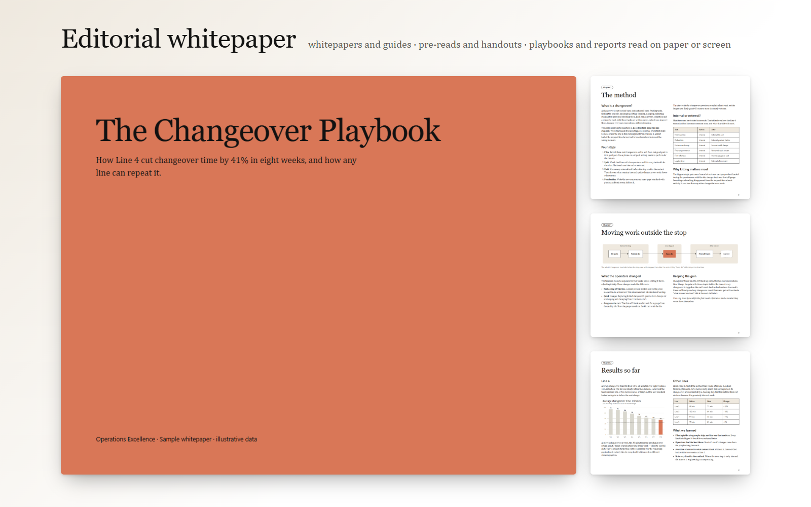

# slide-creator

An agent skill that lets GitHub Copilot (or Claude) make **properly designed slide decks** from Markdown —
with diagrams and charts that match, a check of the rendered result, and swappable visual styles.

Built for locked-down corporate PCs: everything installs with **npm** (plus optional **pip**), renders with
the **Edge or Chrome you already have**, and runs offline — nothing is sent to web services.

| | |
|---|---|
| **Slides** | [Marp](https://marp.app) Markdown → PDF. You edit the Markdown; the PDF is rebuilt from it. |
| **Diagrams** | [D2](https://d2lang.com) via its npm (WebAssembly) build → SVG |
| **Charts** | [Vega-Lite](https://vega.github.io/vega-lite/) → SVG |
| **Icons** | [Lucide](https://lucide.dev) (offline SVGs) |
| **Inspection** | headless Edge/Chrome via Playwright: per-slide PNGs, contact sheet, layout & contrast checks |
| **Styles** | token-based style packs; three slide styles and one document style built in; import your own from a .pptx/.pdf |

## The built-in styles

Every style below is the same Markdown, rendered by `npm run samples` — only the style name changes.



**editorial** — calm and book-like: serif titles, warm paper, one clay accent. For explainers, training and
strategy narratives. [PDF](skill/slide-creator/samples/editorial.pdf) · [dark](skill/slide-creator/samples/editorial-dark.pdf) · [all slides](skill/slide-creator/samples/editorial.png)



**boardroom** — consulting / executive: white, navy, action titles, a strict grid. For leadership updates,
business cases and reviews read without a presenter. [PDF](skill/slide-creator/samples/boardroom.pdf) · [dark](skill/slide-creator/samples/boardroom-dark.pdf) · [all slides](skill/slide-creator/samples/boardroom.png)



**plant-floor** — industrial: header bar, condensed headings, mono labels, safety colours. For operations,
CI/A3, engineering and project status. [PDF](skill/slide-creator/samples/plant-floor.pdf) · [dark](skill/slide-creator/samples/plant-floor-dark.pdf) · [all slides](skill/slide-creator/samples/plant-floor.png)



**editorial-whitepaper** — for documents people **read** rather than watch: whitepapers, playbooks,
pre-reads, handouts. The editorial look set as a printed guide: US Letter landscape pages, serif body text in
two columns, sans subheads, tables, full-width figures, colour cover and chapter pages; ~350–550 words a page.
[PDF](skill/slide-creator/samples/editorial-whitepaper.pdf) · [dark](skill/slide-creator/samples/editorial-whitepaper-dark.pdf) · [all pages](skill/slide-creator/samples/editorial-whitepaper.png) · [source](skill/slide-creator/examples/whitepaper/deck.md)

Slide samples come from one 12-slide showcase deck ([source](skill/slide-creator/examples/showcase/deck.md)).
Every style has a dark scheme, and any colour can be overridden per deck (your brand colours, for example).
Ask for a document by name (*"Write this up as an editorial-whitepaper document"*), or start one with
`node <skill>/scripts/new.mjs my-paper --style editorial-whitepaper`.

---

## Get it working

### 1. What you need

- **Node.js 18 or newer** (`node -v`).
- **Microsoft Edge or Google Chrome** — already on every Windows PC. Nothing else is downloaded.
- **Git**, to get this repo.
- *Optional:* Python 3.9+ — only for importing a style from an existing .pptx/.pdf.

### 2. Get the skill

```
git clone https://github.com/johnml1135/slide-creator.git
```

The skill itself is the folder `skill/slide-creator/`. You never run anything from the clone directly —
the installer copies the skill to where your agent looks for skills.

### 3. Install it — pick one

**A. Into a repository (recommended for teams).** Everyone who clones that repo gets the skill in
Copilot (VS Code agent mode, Copilot CLI, Copilot cloud agent) and Claude Code.

```
node slide-creator/skill/slide-creator/scripts/install.mjs --repo C:\path\to\your-repo
```

This copies the skill to `your-repo/.github/skills/slide-creator/`, adds its `node_modules/` to the repo's
`.gitignore`, installs the npm packages, and runs a health check (`doctor`). Then commit:

```
cd C:\path\to\your-repo
git add .gitignore .github/skills/slide-creator
git commit -m "Add slide-creator skill"
```

Teammates run this once after pulling (or simply ask Copilot to make a deck — the skill tells it to):

```
npm ci --prefix .github/skills/slide-creator
```

**B. Just for you, in every project.** Installs to `~/.copilot/skills/slide-creator/`:

```
node slide-creator/skill/slide-creator/scripts/install.mjs --personal
```

**C. Copilot cloud agent** (assigning issues to Copilot on github.com). Do option A with one more flag:

```
node slide-creator/skill/slide-creator/scripts/install.mjs --repo C:\path\to\your-repo --cloud-agent
```

This also writes `.github/workflows/copilot-setup-steps.yml`, which installs the skill's packages before
the agent starts (the runner's Chrome does the rendering). Commit it **to the default branch** — Copilot
only uses it from there. If the file already exists, the installer prints the steps to add instead.

**D. Claude Code or Claude.ai.** Claude Code: `--to ~/.claude/skills/slide-creator` (or option A — Claude
Code also reads `.claude/skills/` in a repo; copy there with `--to <repo>/.claude/skills/slide-creator`).
Claude.ai: zip the `skill/slide-creator` folder and upload it under Settings → Capabilities → Skills.

**Updating:** `git pull` in the clone and run the same install command again. It replaces the skill files
and keeps the installed packages.

### 4. Check it

The installer ends with the health check. Run it again any time:

```
node .github/skills/slide-creator/scripts/doctor.mjs        # or ~/.copilot/skills/slide-creator/...
```

All lines should show ✓. If it can't find a browser, set `SLIDE_BROWSER` to the full path of `msedge.exe`
or `chrome.exe`.

---

## Use it with GitHub Copilot

**VS Code:** open Copilot Chat, switch to **Agent** mode, and ask — or type `/slide-creator` to call the
skill by name:

> *Make a 10-slide plant-floor deck on our Line 4 changeover results, from notes.md. Put it in decks/line4.*

Copilot reads the skill, scaffolds the deck folder, writes the slides, diagrams and charts, and runs the
build in the terminal. Approve the `node …/build.mjs` commands when asked. To stop being asked, allow-list
them in `.vscode/settings.json`:

```json
{ "chat.tools.terminal.autoApprove": { "node": true, "npm": true } }
```

The result lands in the deck folder: `build/<deck-name>.pdf`, plus `build/contact-sheet.png` and
`build/report.md`, which Copilot uses to check and fix its own work before handing over.

To see edits as you make them, run **Terminal: Run Task → Slides: preview (watch)** and enter the deck
folder. Or run `node .github/skills/slide-creator/scripts/build.mjs decks/line4 --watch` in the terminal.
Open the printed local URL in a browser, or use VS Code's **Simple Browser: Show** command. Saving
`deck.md`, diagrams, charts, images, `slides.json`, or style files refreshes the preview; the small panel
shows source checks and build errors. The preview skips the slow PDF and visual inspection steps. When
ready to share, run **Slides: build PDF** or the build command without `--watch`, then review the contact
sheet and report. The installer adds these two tasks and three short Copilot prompts (`/new-deck`,
`/new-document`, `/review-deck`) when their files are absent.

**Copilot CLI:** run `copilot` in the repo and ask the same way.
**Copilot cloud agent:** assign an issue such as *"Create a boardroom deck in decks/q3-review from
docs/q3.md"*. The pull request contains the deck source (Markdown, diagrams, charts); build output is
git-ignored, so run the build locally — or ask Copilot to build it — to get the PDF.

Other things to ask for:
- *"Rebuild this deck in the boardroom style"* / *"…in dark mode"* / *"use our brand colours #0A3D62 and #E58E26"*
- *"Import the style from template.pptx and use it for this deck"* (needs the optional Python step:
  `pip install -r <skill>/requirements.txt`)
- *"Check this deck's design and fix what's weak"*

### If Copilot doesn't use the skill

- Check that `SKILL.md` is at `.github/skills/slide-creator/SKILL.md` (or `~/.copilot/skills/slide-creator/SKILL.md`),
  then reload VS Code. Type `/` in Chat: `slide-creator` should be listed.
- Make sure Chat is in **Agent** mode — Ask/Edit modes can't run the build.
- Mention it explicitly: *"Use the slide-creator skill to …"*.

### Troubleshooting

| Problem | Fix |
|---|---|
| `npm ci` fails behind a corporate proxy | `npm config set proxy http://proxy:port` and `https-proxy`, or point `registry` at your internal mirror |
| `doctor`: no browser / headless browser failed | set `SLIDE_BROWSER` to `msedge.exe` or `chrome.exe`; some PCs block headless Edge — try Chrome, or ask IT |
| Fonts look different from the samples | styles use Windows/Office fonts (Aptos, Segoe UI, Georgia…) with fallbacks; on Linux/macOS the fallbacks are used |
| A build error mentions a diagram line | the line number is in your `.d2` file; see `references/diagrams.md` |

---

## Use it by hand

```
node <skill>/scripts/new.mjs my-deck --style boardroom
node <skill>/scripts/build.mjs my-deck              # add --scheme dark or --style other
```

`<skill>` is where you installed it, e.g. `.github/skills/slide-creator`. The build writes
`my-deck/build/my-deck.pdf`, one PNG per slide, a contact sheet and a report. The PDF name comes from
`slides.json` `name` when set, otherwise from the folder name. It includes title bookmarks and optional
author metadata (`author` in the deck front matter or `slides.json`).

## Repo layout

```
skill/slide-creator/        ← the skill (this is what gets installed)
  SKILL.md                  agent instructions
  styles/                   editorial, boardroom, plant-floor, editorial-whitepaper (style.json, style.css, guide.md, reference/)
  assets/base.css           shared layouts and components
  scripts/                  install, doctor, new, build, inspect, lint, samples, import_style.py
  references/               layouts, tokens, diagrams, charts, rubric, design basics
  workflows/new-style.md    create / import / change a style
  examples/showcase/        one deck using every layout — the test deck for any slide style
  examples/whitepaper/      a 9-page document — the test document for editorial-whitepaper
  samples/                  showcase rendered in each style (light and dark)
```

## Status

Version 0.1. The full pipeline (Marp, D2, Vega-Lite, inspection) runs end to end on Windows with Edge;
the samples and style reference images are real renders. Output is PDF only, by design: the Markdown
is the editable source.

## License

[MIT](LICENSE) © 2026 John Lambert. The tools npm installs alongside it (Marp, D2, Vega, Lucide, Playwright) keep their own licenses.
