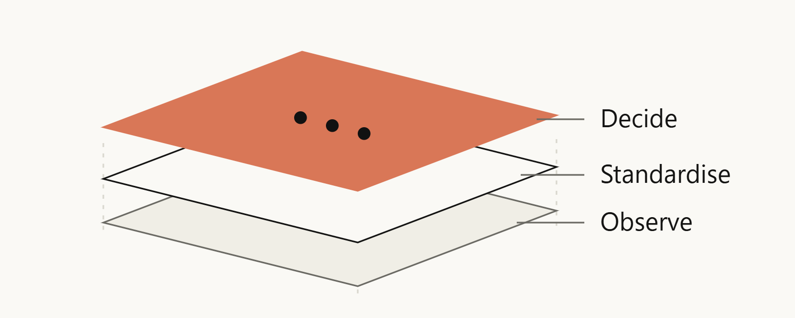

<!-- _class: cover -->
<!-- _paginate: false -->

###### From evidence to action
# Make the next decision easier

A visual story assembled from reusable parts.

---

<!-- _class: diagram -->

###### A reusable composition
## Shared evidence supports one clear decision

Fixed geometry, three labels, one accent. No freehand path drawing is needed.

---

## Each visual earns its place in the story

<i data-icon="layers"></i><h3>Compose</h3>
Start with reviewed shapes and a clear hierarchy.

<i data-icon="focus"></i><h3>Focus</h3>
Give the reader one place to look first.

<i data-icon="scan-eye"></i><h3>Review</h3>
Render the result at its final size.

---

## Local images can share a consistent treatment

Original local raster illustration.

Duotone follows the current style.

---

## A solid panel keeps image captions readable

Let the picture carry the idea. Give the text a calm place to sit.

---

<!-- _class: closing -->
<!-- _paginate: false -->

###### Quality comes from review
# Reuse the parts. Refine the story.

The sample raster was rendered from the SVG offline.
